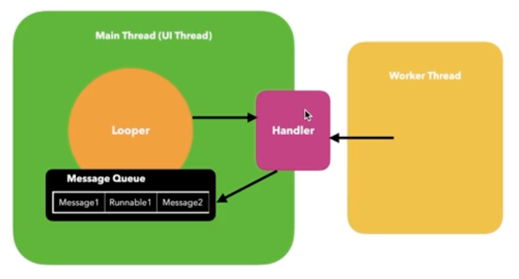

# ⏰스톱워치
## 🛠️구현 기능 
1️⃣ 스톱워치 기능 
- 0.1초마다 숫자 업데이트
- 시작, 일시정지, 정지
- 정지 전 다이얼로그 알람  

2️⃣ 시작전 카운트 다운 추가  
3️⃣ 카운트 다운 3초전 알림음  
4️⃣ 랩타임 기록

## 🛠기능
UI 
- constraintLayout
- ProgressBar

Android
- AlertDialog
- Thread
- runOnUiThread
- ToneGenerator
- addView

## Thread
스레드 : 작업 공간  
메인 스레드(UI 스레드) : 애플리케이션이 실행되면서 안드로이드 시스템이 생성하는 스레드로, UI 를 그리는 역할  
작업자 스레드 (Worker Thread) : 메인 스레드 이외의 스레드  

### 규칙
1. UI 스레드를 차단하지 마세요.  
   앱이 일정 시간 동안 반응이 없을 경우 ANR (Application Not Responding)  
    _**ANR을 유발하는 요인** : 네트워크 액세스_
2. UI 스레드 외부에서 Android UI 도구 키트에 액세스 하지 마세요.

### 해결방법
- Activity.runOnUiThread(Runnable)
- View.post(Runnable)
- View.postDelayed(Runnable, long)
- Handler

